<div align="center">


# AI Evolution Jarvis

### Prywatny asystent AI, który rozmawia, pamięta i wykonuje zadania

[](https://github.com/aievolutionpl/ai-evolution-jarvis)
[](apps/desktop)
[](LICENSE)
[](https://github.com/NousResearch/hermes-agent)

**Jeden interfejs do rozmowy głosowej, automatyzacji, narzędzi, pamięci i codziennej pracy z AI.**

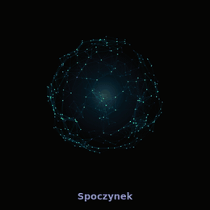

</div>


---

## Spis treści

- [Czym jest Jarvis](#czym-jest-jarvis)
- [Szybki start](#szybki-start)
- [Jak to działa — architektura](#jak-to-działa--architektura)
- [Interfejs: jeden system](#interfejs-jeden-system)
- [Orb: żywy rdzeń](#orb-żywy-rdzeń)
- [Głos: klasyczny i Live](#głos-klasyczny-i-live)
- [Raport dnia: „wake up, tatuś wrócił”](#raport-dnia-wake-up-tatuś-wrócił)
- [Połączenia: Google, poczta, komunikatory i API](#połączenia-google-poczta-komunikatory-i-api)
- [Pulse: Jarvis sam proponuje](#pulse-jarvis-sam-proponuje)
- [Powiadomienia na telefon (ntfy)](#powiadomienia-na-telefon-ntfy)
- [Modele i OpenRouter](#modele-i-openrouter)
- [Motyw i język](#motyw-i-język)
- [Konfiguracja](#konfiguracja)
- [Bezpieczeństwo](#bezpieczeństwo)
- [Dla programistów](#dla-programistów)
- [Roadmapa](#roadmapa)

---

## Czym jest Jarvis

AI Evolution Jarvis to prywatny, instalowalny asystent AI z natywną aplikacją desktopową. Rozmawiasz z nim tekstem albo głosem, a on naprawdę wykonuje pracę: uruchamia narzędzia, czyta i zapisuje pliki, przegląda sieć, pamięta Cię między rozmowami i pilnuje zadań cyklicznych.

Sercem produktu jest **[Hermes Agent](https://github.com/NousResearch/hermes-agent)**. Jarvis nie tworzy drugiego backendu ani drugiej pętli agenta — to dopracowana warstwa produktu na silniku Hermesa: pulpit, orb, głos, onboarding i raport dnia.

| Ciemny motyw | Jasny motyw |
| --- | --- |
| 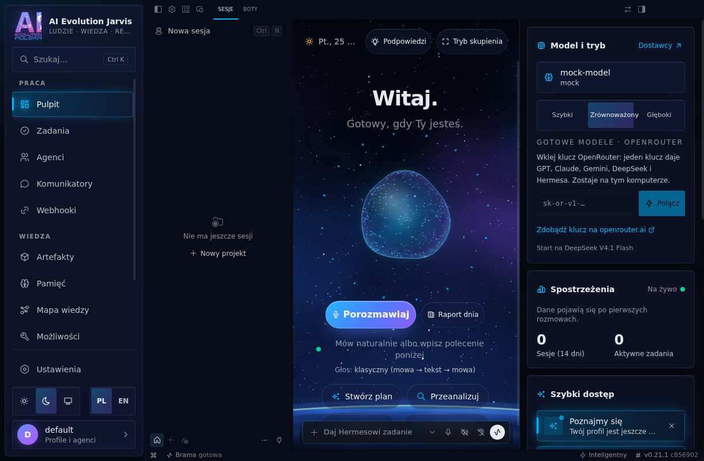 | 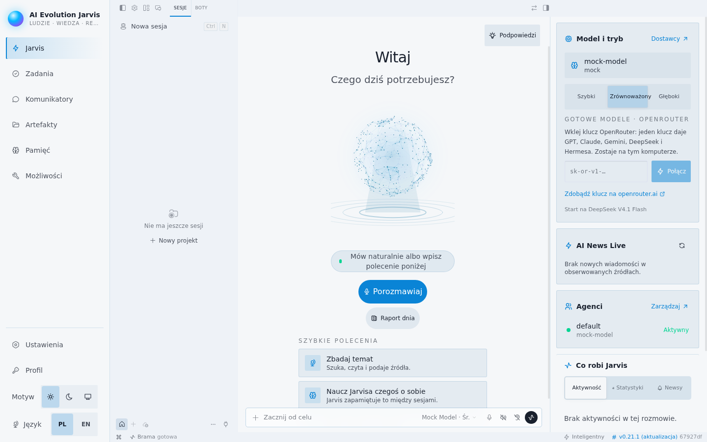 |

### Co potrafi

| | Funkcja | W skrócie |
| --- | --- | --- |
| 🎙️ | **Rozmowa głosowa** | Mów naturalnie, wejdź w słowo, osobno zatrzymaj dźwięk i zadanie. |
| ⚡ | **Głos Live (OpenAI Realtime)** | Opcjonalnie: najnowszy głos GPT Realtime z niskim opóźnieniem; pracę i tak wykonuje Jarvis. |
| 📰 | **Raport dnia** | „Wake up, tatuś wrócił” → świat i AI z wczoraj oraz stan workspace, opowiedziane na głos. |
| 🔮 | **Żywy orb** | Sieć cząsteczek, która zmienia kształt, gdy Jarvis słucha, mówi i pracuje. |
| 🌐 | **OpenRouter w jednym kroku** | Wklej klucz i pracuj na **DeepSeek V4.1 Flash**; GPT, Claude, Gemini, Hermes jednym kliknięciem. |
| 🛠️ | **Realna praca** | Narzędzia, terminal, pliki, przeglądarka, MCP, research, automatyzacje. |
| 🧠 | **Pamięć i profile** | Pamięć między sesjami, profile, umiejętności i agenci Hermesa. |
| ⏰ | **Zadania cykliczne** | Gotowe szablony (poranny raport, ważne maile, podsumowanie tygodnia…) i własne. |
| 💬 | **Komunikatory** | Telegram, Discord, Slack, WhatsApp, e-mail i kilkanaście innych kanałów. |
| 📱 | **Powiadomienia na telefon** | Gdy praca się skończy albo Jarvis czeka na odpowiedź — push przez [ntfy](https://github.com/binwiederhier/ntfy). |
| 🌗 | **Jasny i ciemny motyw** | Dopracowane obie palety; orb rysuje się inaczej na jasnym i ciemnym tle. |
| 🌍 | **Polski i angielski** | Cały interfejs PL / EN — polski jest pełnoprawnym językiem produktu. |
| ♿ | **Dostępność** | Klawiatura, widoczny fokus, ograniczony ruch, układ od telefonu po szeroki ekran. |

---

## Szybki start

### 1. Instalacja jednym poleceniem


Jarvis instaluje się jak zwykła aplikacja — z własną ikoną, w menu Start / Launchpadzie / menu aplikacji i ze **skrótem na pulpicie**. Skrypt wybiera plik dla Twojego systemu z najnowszego wydania, instaluje go **bez uprawnień administratora**, prowadzi przez 4 kroki (system → pobieranie → instalacja → ikona i skróty) i na końcu mówi, co dalej.

**Linux / macOS**

```bash
curl -fsSL https://raw.githubusercontent.com/aievolutionpl/ai-evolution-jarvis/main/scripts/install-jarvis.sh | bash
```

**Windows (PowerShell)**

```powershell
irm https://raw.githubusercontent.com/aievolutionpl/ai-evolution-jarvis/main/scripts/install-jarvis.ps1 | iex
```

`--dry-run` / `-DryRun` pokazuje tylko, co zostanie pobrane; `--version v0.17.2` / `-Version v0.17.2` instaluje konkretne wydanie. Wolisz ręcznie? Zobacz [instalację z Releases](#ręcznie-z-releases).

| System | Gdzie znajdziesz Jarvisa po instalacji |
| --- | --- |
| **Windows** | skrót na pulpicie i w menu Start (grupa *AI Evolution*); przypnij do paska zadań prawym przyciskiem |
| **macOS** | `Programy` i Launchpad; w Docku: prawy przycisk → *Opcje → Zachowaj w Docku* |
| **Linux** | menu aplikacji (z ikoną) oraz skrót na pulpicie, który aplikacja zakłada przy pierwszym starcie |

Skrót na pulpicie powstaje raz — jeśli go usuniesz, nie wróci sam. Przywrócisz go w **Ustawienia → Zaawansowane → Ikona na pulpicie**.

### 2. Pierwsze uruchomienie w 2 minuty

Kreator ma dziewięć krótkich kroków. Zaczyna od wyjaśnienia, **jak działa Jarvis**, a kończy na tym, **co chcesz z nim połączyć**.

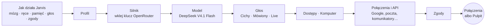
```mermaid
flowchart LR
    W["Jak działa Jarvis<br/>mózg · ręce · pamięć · głos · zgody"] --> P["Profil"]
    P --> S["Silnik<br/>wklej klucz OpenRouter"]
    S --> M["Model<br/>DeepSeek V4.1 Flash"]
    M --> G["Głos<br/>Cichy · Mówiony · Live"]
    G --> D["Dostępy · Komputer"]
    D --> C["Połączenia i API<br/>Google, poczta, komunikatory…"]
    C --> Z["Zgody"]
    Z --> J(("Połączenia<br/>albo Pulpit"))
```

| Krok „Jak działa Jarvis” | Krok „Połączenia i API” |
| --- | --- |
| 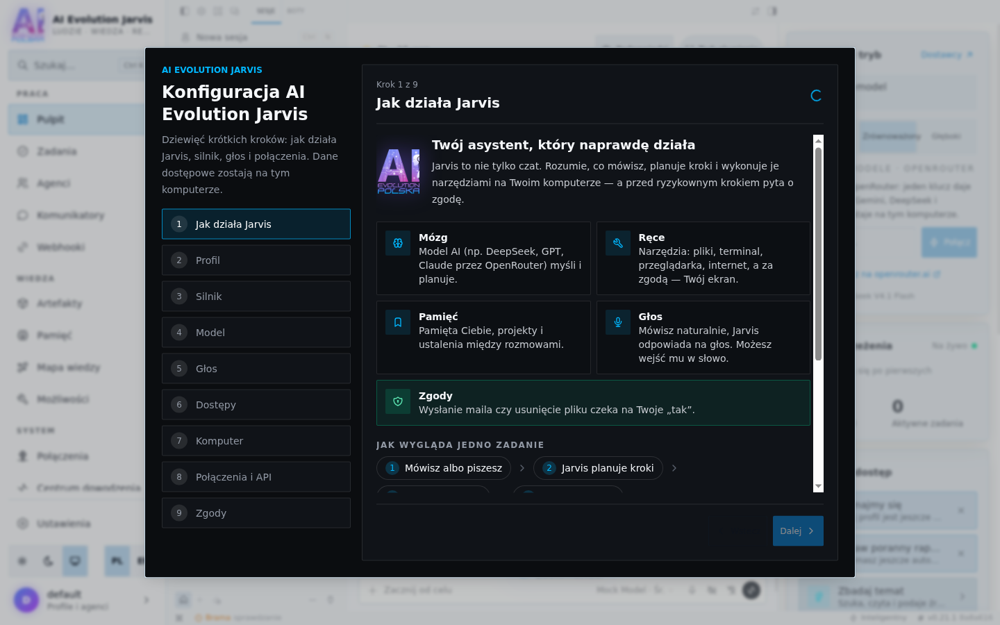 | 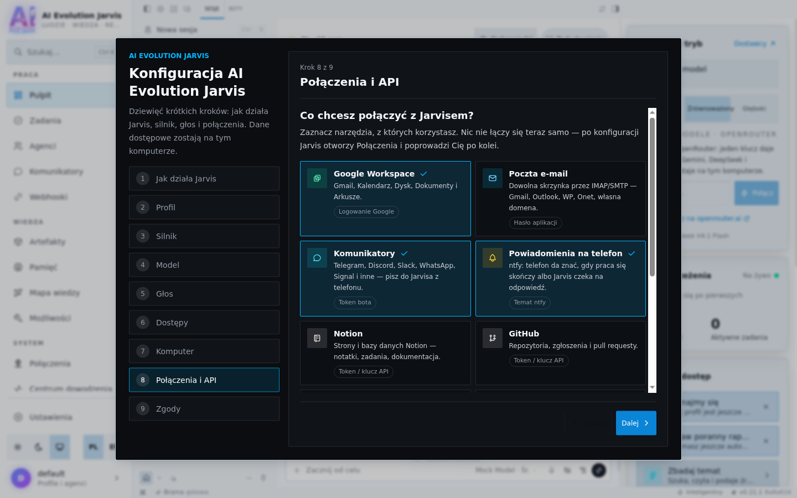 |

0. **Jak działa Jarvis** — pięć klocków (mózg, ręce, pamięć, głos, zgody), jak wygląda jedno zadanie i co możesz zrobić już dziś.
1. **Silnik** — wklej klucz z [openrouter.ai/keys](https://openrouter.ai/keys) i kliknij **Połącz**. Jarvis sprawdzi klucz, zapisze go na tym komputerze i od razu wybierze **DeepSeek V4.1 Flash**.
2. **Model** — kliknij „Sprawdź konfigurację”.
3. **Głos** — *Cichy* (bez czytania na głos), *Mówiony* (odpowiedzi czytane na głos) albo **Live** (OpenAI Realtime — klucz OpenAI wkleisz od razu tutaj).
4. **Dostępy, Komputer** — co Jarvis może robić na tym komputerze.
5. **Połączenia i API** — zaznacz, z czego korzystasz (Google, poczta, komunikatory, telefon…). Nic nie łączy się samo: po zakończeniu Jarvis otworzy stronę **Połączenia** z Twoimi wyborami na górze.
6. **Zgody** — zatwierdź i gotowe.

Kto skończył kreator w starszej wersji, nie musi przechodzić go od nowa — nowe kroki są oznaczone jako zrobione, a Połączenia czekają w menu.

| Krok „Silnik” | Krok „Głos” |
| --- | --- |
| 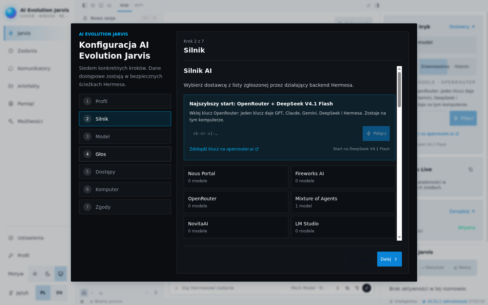 | 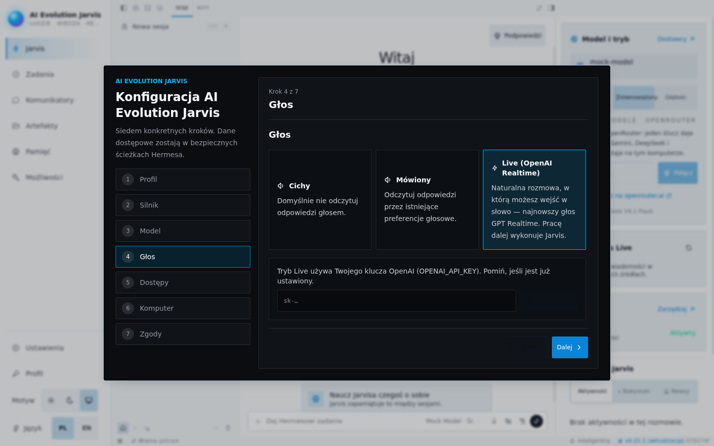 |

Pominąłeś klucz w kreatorze? Wkleisz go później w prawym panelu pulpitu, w karcie **Model i tryb**.

---

## Jak to działa — architektura

Jarvis to trzy warstwy, z których każda odpowiada za jedną rzecz.

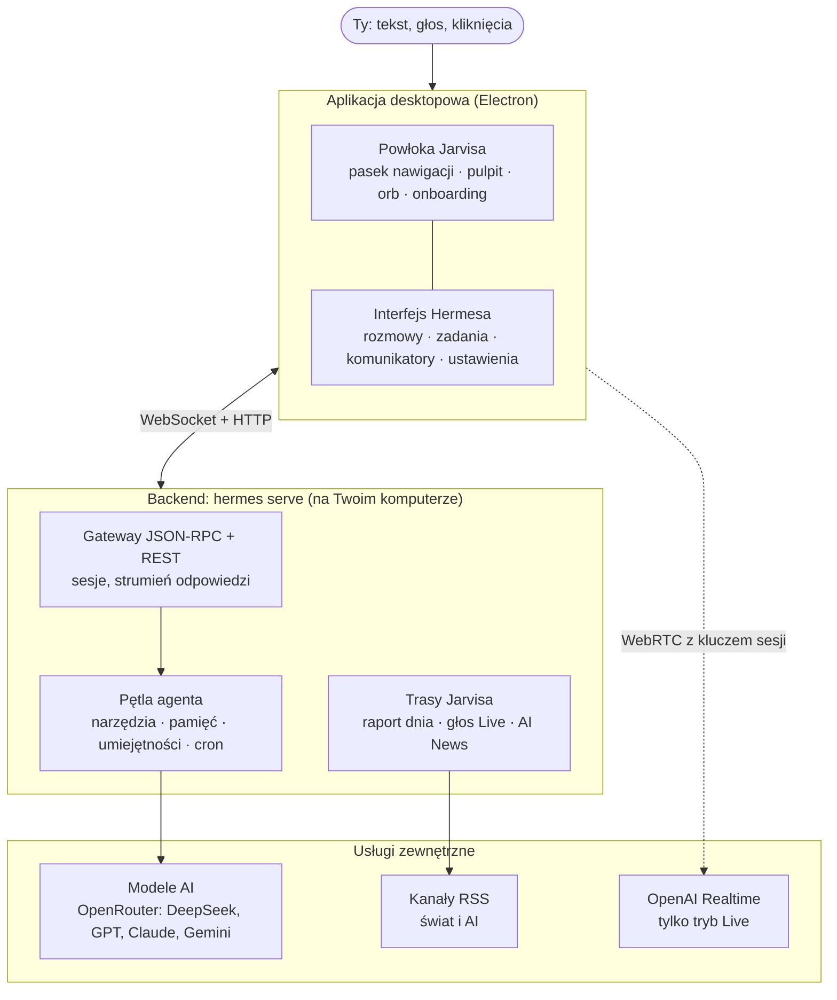
```mermaid
flowchart TB
    U(["Ty: tekst, głos, kliknięcia"])

    subgraph APP["Aplikacja desktopowa (Electron)"]
        direction TB
        SHELL["Powłoka Jarvisa<br/>pasek nawigacji · pulpit · orb · onboarding"]
        RT["Interfejs Hermesa<br/>rozmowy · zadania · komunikatory · ustawienia"]
        SHELL --- RT
    end

    subgraph BE["Backend: hermes serve (na Twoim komputerze)"]
        direction TB
        GW["Gateway JSON-RPC + REST<br/>sesje, strumień odpowiedzi"]
        AG["Pętla agenta<br/>narzędzia · pamięć · umiejętności · cron"]
        API["Trasy Jarvisa<br/>raport dnia · głos Live · AI News"]
        GW --> AG
    end

    subgraph EXT["Usługi zewnętrzne"]
        LLM["Modele AI<br/>OpenRouter: DeepSeek, GPT, Claude, Gemini"]
        RTV["OpenAI Realtime<br/>tylko tryb Live"]
        RSS["Kanały RSS<br/>świat i AI"]
    end

    U --> APP
    APP <-->|"WebSocket + HTTP"| BE
    AG --> LLM
    API --> RSS
    APP -.->|"WebRTC z kluczem sesji"| RTV
```

| Warstwa | Za co odpowiada | Czego nie robi |
| --- | --- | --- |
| **Electron** | okno, system, instalacja, aktualizacje, bezpieczny most do funkcji natywnych | nie zna logiki agenta |
| **Interfejs (React)** | nawigacja, pulpit, orb, głos, stan prezentacji | nie wykonuje pracy agenta |
| **Hermes (backend)** | jedyne źródło prawdy: sesje, modele, narzędzia, pamięć, zadania, klucze | nie rysuje interfejsu |

Dzięki temu ta sama rozmowa działa z tekstu, z głosu i z raportu dnia — wszystko trafia do jednej pętli agenta.

---

## Interfejs: jeden system

Pulpit Jarvisa i ekrany Hermesa to jedna aplikacja z **jedną nawigacją**.

**Pulpit** w skrócie:

- **Górny pasek** — dzisiejsza data (słońce w dzień, księżyc wieczorem), **Podpowiedzi** i **Tryb skupienia**.
- **Środek** — powitanie zależne od pory dnia, orb z kropkowaną orbitą na tle gwiazd i horyzontu planety, „Porozmawiaj” i „Raport dnia”, a pod nimi cztery akcje: **Stwórz plan · Przeanalizuj · Wygeneruj · Zautomatyzuj** (każda zaczyna prośbę w polu rozmowy — dokończysz ją sam).
- **Prawy panel** — **Model i tryb**, **Spostrzeżenia** (prawdziwe sesje z 14 dni na wykresie, zmiana tydzień do tygodnia, aktywne zadania), **Szybki dostęp** (propozycje Pulse i skróty), AI News Live, agenci i „Co robi Jarvis”.
- **Tryb skupienia** chowa prawy panel — zostajesz Ty, orb i rozmowa; szybki dostęp przenosi się wtedy pod orb.

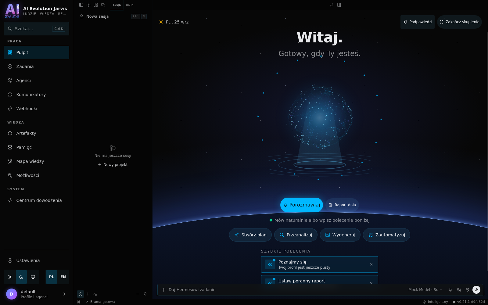

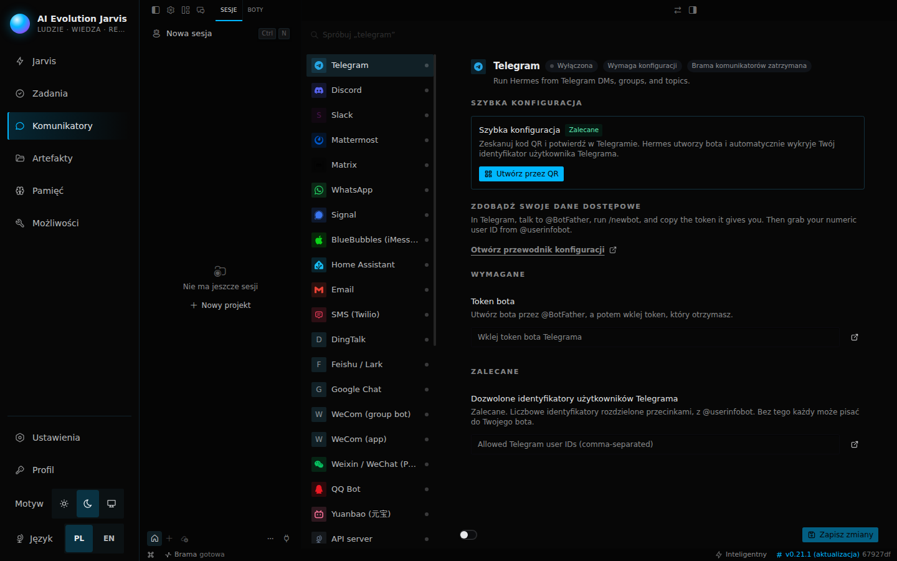

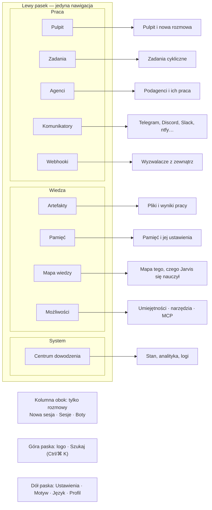
```mermaid
flowchart LR
    subgraph RAIL["Lewy pasek — jedyna nawigacja"]
        subgraph W["Praca"]
            J["Pulpit"]
            T["Zadania"]
            AG["Agenci"]
            K["Komunikatory"]
            WH["Webhooki"]
        end
        subgraph KN["Wiedza"]
            A["Artefakty"]
            P["Pamięć"]
            SM["Mapa wiedzy"]
            M["Możliwości"]
        end
        subgraph SY["System"]
            CC["Centrum dowodzenia"]
        end
    end

    J --> H["Pulpit i nowa rozmowa"]
    T --> C["Zadania cykliczne"]
    AG --> AGS["Podagenci i ich praca"]
    K --> MS["Telegram, Discord, Slack, ntfy…"]
    WH --> WHS["Wyzwalacze z zewnątrz"]
    A --> AR["Pliki i wyniki pracy"]
    P --> MEM["Pamięć i jej ustawienia"]
    SM --> SMS["Mapa tego, czego Jarvis się nauczył"]
    M --> CAP["Umiejętności · narzędzia · MCP"]
    CC --> CCS["Stan, analityka, logi"]

    SB["Kolumna obok: tylko rozmowy<br/>Nowa sesja · Sesje · Boty"]
    TOP["Góra paska: logo · Szukaj (Ctrl/⌘ K)"]
    BOT["Dół paska: Ustawienia · Motyw · Język · Profil"]
```

- **Lewy pasek** prowadzi do każdego miejsca w aplikacji — dziesięć ekranów w trzech grupach (Praca, Wiedza, System), wyszukiwarka otwierająca paletę poleceń (Ctrl/⌘ K) i karta profilu na dole. Każdy ekran otwiera się w obszarze roboczym, więc pasek zawsze zostaje pod ręką.
- **Kolumna obok** pokazuje tylko Twoje rozmowy (Sesje / Boty) i przycisk „Nowa sesja”.
- **Jeden pasek statusu** na dole: połączenie, model, wersja. Pulpit pokazuje ostrzeżenie tylko wtedy, gdy połączenie zostało utracone.

---

## Orb: żywy rdzeń

Orb to sieć kilkuset cząsteczek rozłożonych na powłoce kuli. Cząsteczki, które znajdą się blisko siebie, łączą się cienkimi liniami; podczas pracy po liniach biegną świecące „elektrony”.

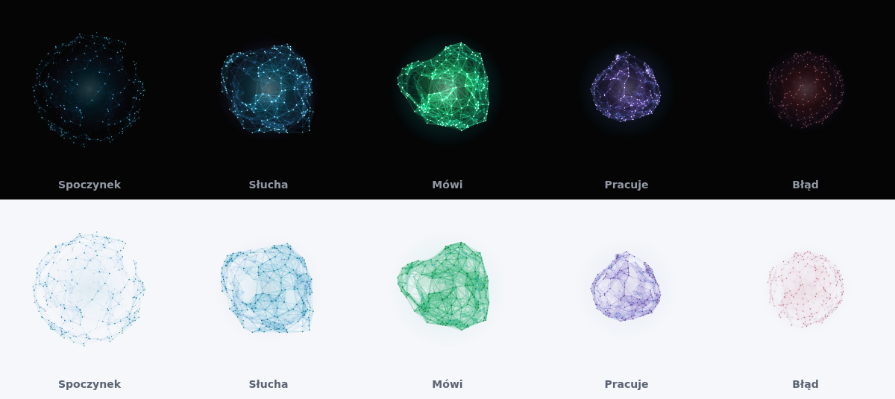

### Stany

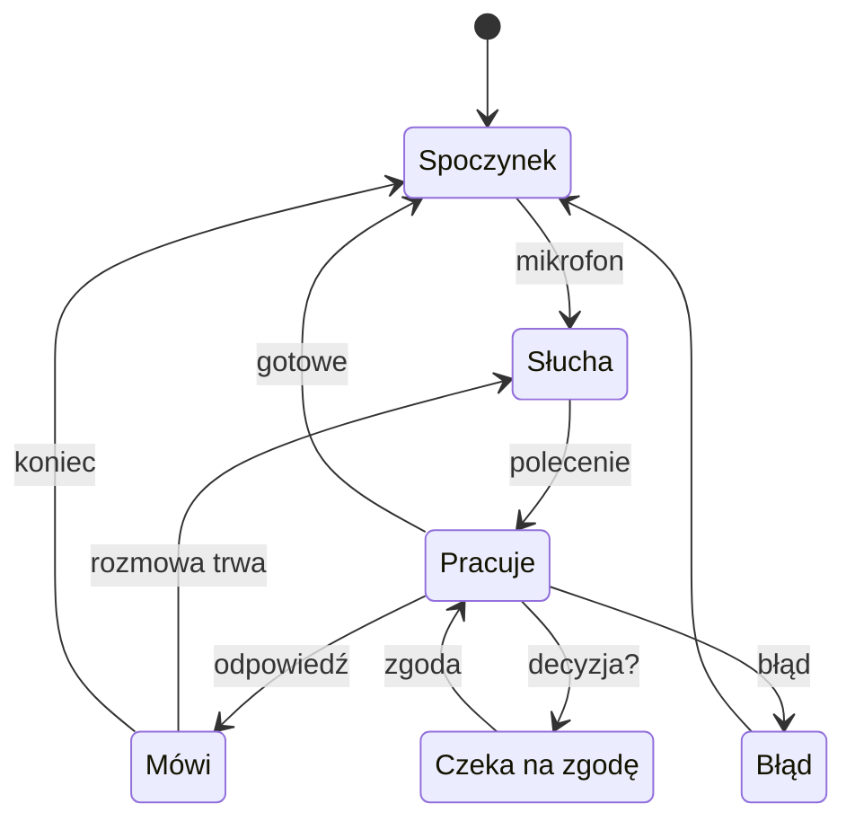
```mermaid
stateDiagram-v2
    state "Spoczynek" as Idle
    state "Słucha" as Listening
    state "Pracuje" as Working
    state "Mówi" as Speaking
    state "Czeka na zgodę" as Approval
    state "Błąd" as Error

    [*] --> Idle
    Idle --> Listening: mikrofon
    Listening --> Working: polecenie
    Working --> Approval: decyzja?
    Approval --> Working: zgoda
    Working --> Speaking: odpowiedź
    Speaking --> Listening: rozmowa trwa
    Speaking --> Idle: koniec
    Working --> Idle: gotowe
    Working --> Error: błąd
    Error --> Idle
```

| Stan | Kolor | Kształt i ruch |
| --- | --- | --- |
| **Spoczynek** | błękit | szeroka, spokojna kula, ledwie oddycha |
| **Słucha** | jasny błękit | zbiera się, a Twój głos wypycha ją z okrągłego kształtu |
| **Mówi** | zieleń | po powierzchni biegną fale w rytm głosu Jarvisa |
| **Pracuje** | fiolet | ciasna, zwija się w obracające się płaty, po liniach biegną elektrony |
| **Czeka na zgodę** | złoto | spokojnie pulsuje, czeka na Twoją decyzję |
| **Błąd** | czerwień | wycofana, mała i powolna |

### Jak orb zmienia kształt

Każda cząsteczka jest przyciągana sprężyną do powierzchni, której promień w danym kierunku to kula wygięta przez **trzy wolno dryfujące fale**. Siła fal zależy od stanu, a gdy Jarvis słucha albo mówi — także od zmierzonego poziomu głosu. Kształt zmienia się płynnie (wygładzona siła fal, ciągła faza), a tłumienie sprawia, że chmura układa się w nowy kształt bez drgań.

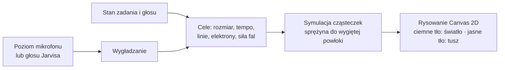
```mermaid
flowchart LR
    MIC["Poziom mikrofonu<br/>lub głosu Jarvisa"] --> EASE["Wygładzanie"]
    STATE["Stan zadania i głosu"] --> TARGET["Cele: rozmiar, tempo,<br/>linie, elektrony, siła fal"]
    EASE --> TARGET
    TARGET --> SIM["Symulacja cząsteczek<br/>sprężyna do wygiętej powłoki"]
    SIM --> DRAW["Rysowanie Canvas 2D<br/>ciemne tło: światło · jasne tło: tusz"]
```

- Rysowanie to czysty **Canvas 2D** (bez WebGL) — lekkie także na słabszym sprzęcie.
- Gdy okno jest schowane, animacja się zatrzymuje; przy włączonym „ograniczaniu ruchu” orb pokazuje jedną nieruchomą klatkę.
- Na pulpicie orb stoi pośrodku nad platformą; w rozmowie jest wyśrodkowany u góry — mały podczas czytania, płynnie rośnie, gdy rozmawiasz głosem.

Kod: [`particle-orb.ts`](apps/desktop/src/app/jarvis/particle-orb.ts) (symulacja), [`plasma.ts`](apps/desktop/src/app/jarvis/plasma.ts) (rysowanie), [`core.tsx`](apps/desktop/src/app/jarvis/core.tsx) (komponent).

---

## Głos: klasyczny i Live

Jarvis ma dwa silniki głosu. Oba uruchamiasz tak samo: **Porozmawiaj** na pulpicie, mikrofon przy polu wiadomości albo `Ctrl+B`. Rozmowę kończysz, mówiąc „stop”.

### Klasyczny (domyślny)

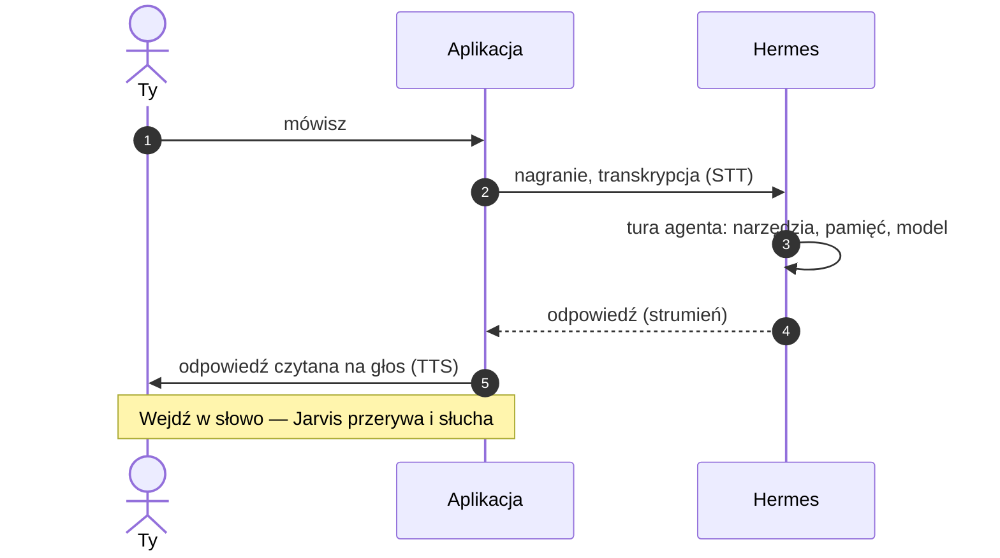
```mermaid
sequenceDiagram
    autonumber
    actor Ty
    participant App as Aplikacja
    participant H as Hermes
    Ty->>App: mówisz
    App->>H: nagranie, transkrypcja (STT)
    H->>H: tura agenta: narzędzia, pamięć, model
    H-->>App: odpowiedź (strumień)
    App->>Ty: odpowiedź czytana na głos (TTS)
    Note over Ty,App: Wejdź w słowo — Jarvis przerywa i słucha
```

### Live (OpenAI Realtime)

Naturalna rozmowa z niskim opóźnieniem. Model realtime jest **tylko głosem** — każde pytanie i polecenie przekazuje Jarvisowi przez narzędzie `ask_jarvis`, więc praca odbywa się w tej samej rozmowie, z pamięcią i narzędziami.

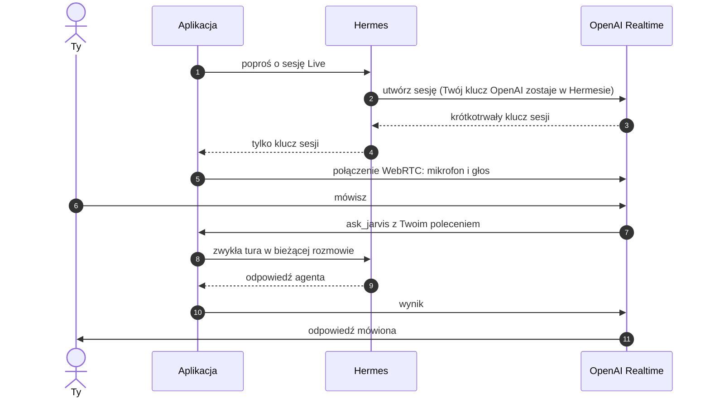
```mermaid
sequenceDiagram
    autonumber
    actor Ty
    participant App as Aplikacja
    participant H as Hermes
    participant RT as OpenAI Realtime
    App->>H: poproś o sesję Live
    H->>RT: utwórz sesję (Twój klucz OpenAI zostaje w Hermesie)
    RT-->>H: krótkotrwały klucz sesji
    H-->>App: tylko klucz sesji
    App->>RT: połączenie WebRTC: mikrofon i głos
    Ty->>RT: mówisz
    RT->>App: ask_jarvis z Twoim poleceniem
    App->>H: zwykła tura w bieżącej rozmowie
    H-->>App: odpowiedź agenta
    App->>RT: wynik
    RT->>Ty: odpowiedź mówiona
```

Włączysz go w kroku „Głos” kreatora albo w `config.yaml` (`voice.engine: realtime`, zobacz [Konfiguracja](#konfiguracja)). Potrzebny jest klucz `OPENAI_API_KEY`.

---

## Raport dnia: „wake up, tatuś wrócił”

Powiedz w rozmowie głosowej **„wake up, tatuś wrócił”** (działa w obu silnikach głosu) albo kliknij **Raport dnia** pod „Porozmawiaj”. Jarvis zbierze prawdziwe dane i opowie je na głos w języku interfejsu:

1. **Świat** — najważniejsze wydarzenia z wczoraj (BBC, Guardian, NPR, TVN24, Polsat News),
2. **AI** — jedna lub dwie rzeczy ze świata AI,
3. **Workspace** — sesje z wczoraj i dziś, zadania cykliczne (najpierw te z błędami), co uruchomi się najbliżej, aktywny model.

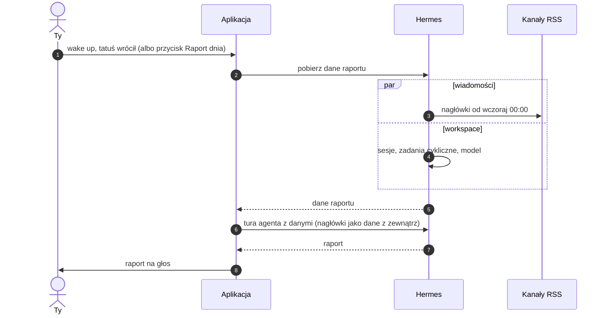
```mermaid
sequenceDiagram
    autonumber
    actor Ty
    participant App as Aplikacja
    participant H as Hermes
    participant RSS as Kanały RSS
    Ty->>App: wake up, tatuś wrócił (albo przycisk Raport dnia)
    App->>H: pobierz dane raportu
    par wiadomości
        H->>RSS: nagłówki od wczoraj 00:00
    and workspace
        H->>H: sesje, zadania cykliczne, model
    end
    H-->>App: dane raportu
    App->>H: tura agenta z danymi (nagłówki jako dane z zewnątrz)
    H-->>App: raport
    App->>Ty: raport na głos
```

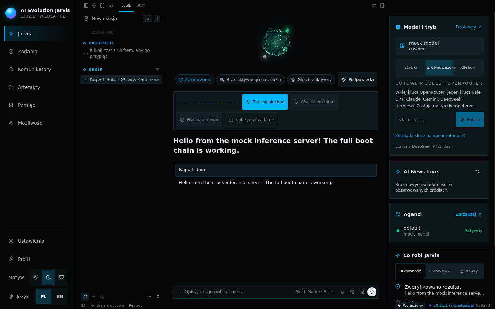

- W historii zobaczysz tylko to, co powiedziałeś lub kliknąłeś — nie cały blok danych.
- Nowa rozmowa dostaje tytuł „Raport dnia · data”; rozmowa, w której już jesteś, zachowuje swoją nazwę.
- Fraza jest rozpoznawana bez względu na wielkość liter, interpunkcję i polskie znaki, także w środku dłuższego zdania.
- Źródło, które nie odpowie, nie psuje raportu — Jarvis je pominie (i może uzupełnić wyszukiwaniem w sieci).
- **Bez otwierania rozmowy:** ustaw słowo wybudzające `sherpa` na frazę raportu — wybudzenie od razu uruchomi raport (zobacz [Konfiguracja](#konfiguracja)).

---

## Pulse: Jarvis sam proponuje

Mechanizm podpatrzony w [Leon](https://github.com/leon-ai/leon) (MIT) i przeniesiony na Jarvisa. Na pulpicie, w karcie **Szybki dostęp** (albo pod orbem w trybie skupienia), Jarvis pokazuje **do trzech propozycji** wynikających z prawdziwego stanu workspace:

| Propozycja | Kiedy się pojawia |
| --- | --- |
| **Napraw „…”** | zadanie cykliczne nie powiodło się przy ostatnim uruchomieniu |
| **Wróć do „…”** | rozmowa z ostatnich 3 dni ma co najmniej 6 wiadomości i nie jest tą, z której właśnie wyszedłeś |
| **Poznajmy się** | profil użytkownika (`memories/USER.md`) jest jeszcze pusty |
| **Ustaw poranny raport** | nie masz jeszcze żadnej automatyzacji |

Kliknięcie propozycji **tylko wpisuje prośbę do pola rozmowy** — nic nie dzieje się bez Ciebie. **Nie teraz** (×) uczy Jarvisa:

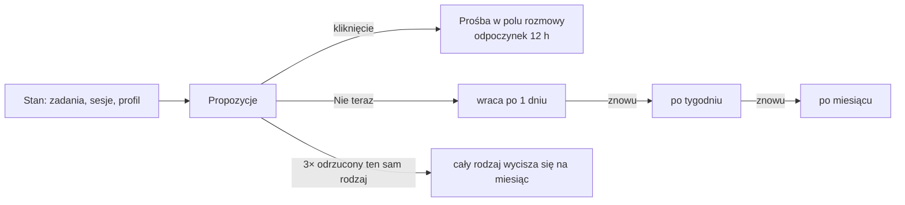
```mermaid
flowchart LR
    S[Stan: zadania, sesje, profil] --> P[Propozycje]
    P -->|kliknięcie| A[Prośba w polu rozmowy<br/>odpoczynek 12 h]
    P -->|Nie teraz| D1[wraca po 1 dniu]
    D1 -->|znowu| D2[po tygodniu]
    D2 -->|znowu| D3[po miesiącu]
    P -->|3× odrzucony ten sam rodzaj| K[cały rodzaj wycisza się na miesiąc]
```

- Pamięć odrzuceń trzyma backend (`jarvis_pulse.json` w katalogu profilu), więc przetrwa restart i dotyczy każdego okna.
- Pulse nigdy nie woła modelu — nie kosztuje tokenów i nie zmienia promptu rozmowy.
- Powitanie na pulpicie zmienia się z porą dnia („Dzień dobry”, „Dobry wieczór”, „Pracujemy do późna”) — jak żywa persona Leona.

---

## Połączenia: Google, poczta, komunikatory i API

Menu **System → Połączenia** zbiera w jednym miejscu wszystko, co można podłączyć do Jarvisa — z instrukcją krok po kroku i przyciskiem, który prowadzi do właściwego miejsca.

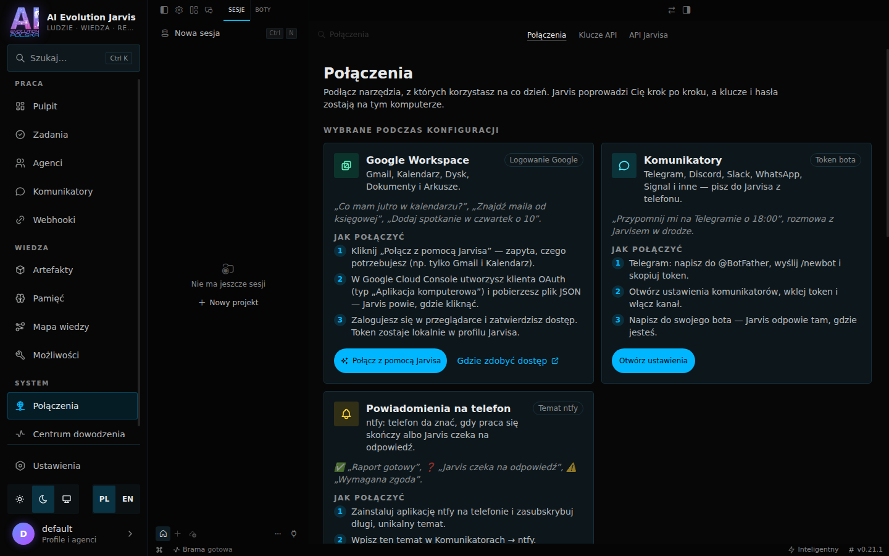

| Połączenie | Dostęp | Jak się łączy |
| --- | --- | --- |
| **Google Workspace** (Gmail, Kalendarz, Dysk, Dokumenty, Arkusze) | logowanie Google (OAuth) | **Połącz z pomocą Jarvisa** — prowadzi przez konfigurację krok po kroku |
| **Poczta e-mail** (IMAP/SMTP) | hasło aplikacji | z pomocą Jarvisa |
| **Komunikatory** (Telegram, Discord, Slack, WhatsApp…) | token bota | Komunikatory |
| **Powiadomienia na telefon** (ntfy) | temat ntfy | Ustawienia → Powiadomienia |
| **Notion** | token integracji | z pomocą Jarvisa |
| **GitHub** | token | z pomocą Jarvisa |
| **Dom** (Home Assistant) | token długoterminowy | Komunikatory → Home Assistant |
| **Setki usług przez MCP** (Zapier, Linear, Figma…) | zależnie od usługi | Możliwości → MCP |

„Połącz z pomocą Jarvisa” otwiera nową rozmowę z gotową prośbą w polu tekstowym — przeczytasz ją, zanim Jarvis ją dostanie.

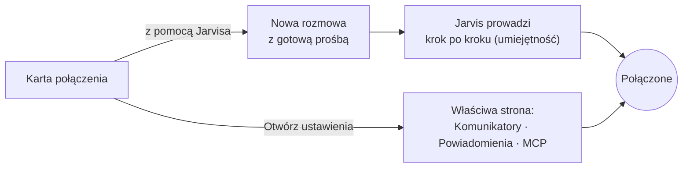
```mermaid
flowchart LR
    K["Karta połączenia"] -->|"z pomocą Jarvisa"| R["Nowa rozmowa<br/>z gotową prośbą"]
    R --> A["Jarvis prowadzi<br/>krok po kroku (umiejętność)"]
    K -->|"Otwórz ustawienia"| U["Właściwa strona:<br/>Komunikatory · Powiadomienia · MCP"]
    A --> T(("Połączone"))
    U --> T
```

### Klucze API — jak je zdobyć i gdzie wkleić

Klucz API to hasło, którym Jarvis przedstawia się usłudze. Wklejasz go **raz, w Ustawieniach** (nigdy do rozmowy) — zostaje zaszyfrowany na tym komputerze. Zakładka **Klucze API** ma linki do każdej strony z kluczami:

| Klucz | Do czego | Gdzie zdobyć |
| --- | --- | --- |
| `OPENROUTER_API_KEY` | GPT, Claude, Gemini, DeepSeek — jeden klucz | [openrouter.ai/keys](https://openrouter.ai/keys) |
| `OPENAI_API_KEY` | GPT i głos Live | [platform.openai.com/api-keys](https://platform.openai.com/api-keys) |
| `ANTHROPIC_API_KEY` | Claude | [console.anthropic.com](https://console.anthropic.com/settings/keys) |
| `GEMINI_API_KEY` | Gemini | [aistudio.google.com/apikey](https://aistudio.google.com/apikey) |
| `ELEVENLABS_API_KEY` | naturalny głos (TTS) | [elevenlabs.io](https://elevenlabs.io/app/settings/api-keys) |
| `TAVILY_API_KEY` | wyszukiwanie w internecie | [app.tavily.com](https://app.tavily.com/home) |

### API Jarvisa — połącz inne aplikacje

Jarvis może udostępnić własne **API zgodne z OpenAI**. Wtedy n8n, Make, Open WebUI, skrypty i Twoje aplikacje rozmawiają z Jarvisem — z jego narzędziami, pamięcią i umiejętnościami.

1. **Komunikatory → API server**: włącz `API_SERVER_ENABLED` i ustaw długi, losowy `API_SERVER_KEY`.
2. Zapisz i uruchom ponownie bramę.
3. W aplikacji wybierz „OpenAI-compatible”: adres `http://127.0.0.1:8642/v1`, klucz, model `hermes-agent`.

```bash
curl http://127.0.0.1:8642/v1/chat/completions \
  -H "Authorization: Bearer TWÓJ_API_SERVER_KEY" \
  -H "Content-Type: application/json" \
  -d '{"model": "hermes-agent", "messages": [{"role": "user", "content": "Cześć Jarvis!"}]}'
```

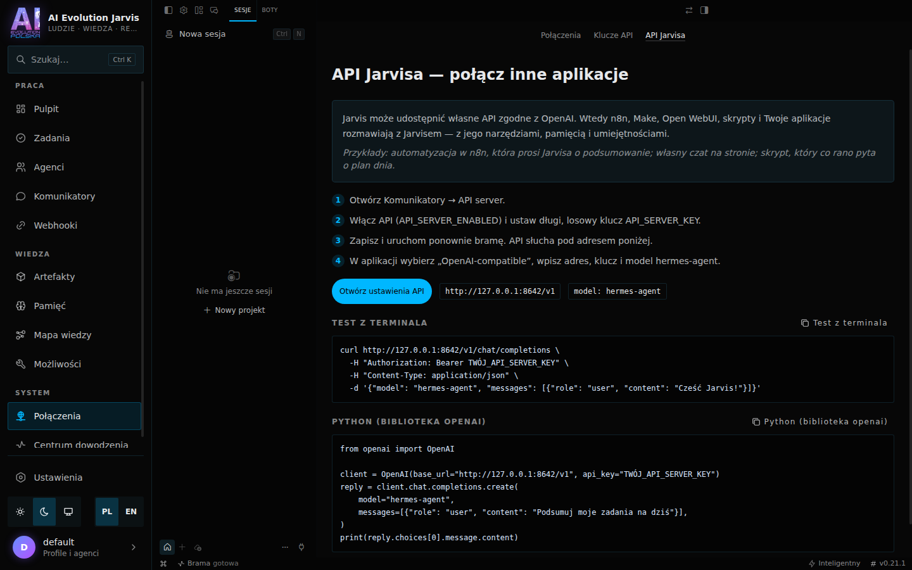

Domyślnie API działa tylko na tym komputerze (`127.0.0.1`). Wystawiasz je dalej — tylko z kluczem i przez bezpieczny tunel.

---

## Powiadomienia na telefon (ntfy)

Jarvis da znać na telefon, gdy **praca się skończy** albo **czeka na Twoją odpowiedź** (zgoda na polecenie, pytanie, hasło) — przez [ntfy](https://github.com/binwiederhier/ntfy), darmowy i otwarty serwis push (publiczny `ntfy.sh` albo własny serwer).

1. Zainstaluj aplikację **ntfy** na telefonie i zasubskrybuj temat, np. `jarvis-twoje-imie-7d4f`.
2. W Jarvisie: **Komunikatory → ntfy** (albo `hermes gateway setup` → ntfy) i wpisz ten sam temat.
3. **Ustawienia → Powiadomienia → „Wysyłaj też na telefon (ntfy)”** i kliknij **Wyślij test na telefon**.

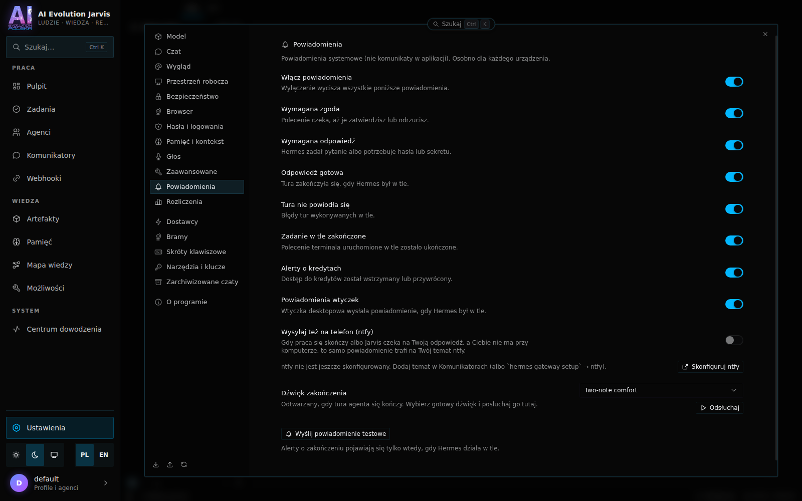

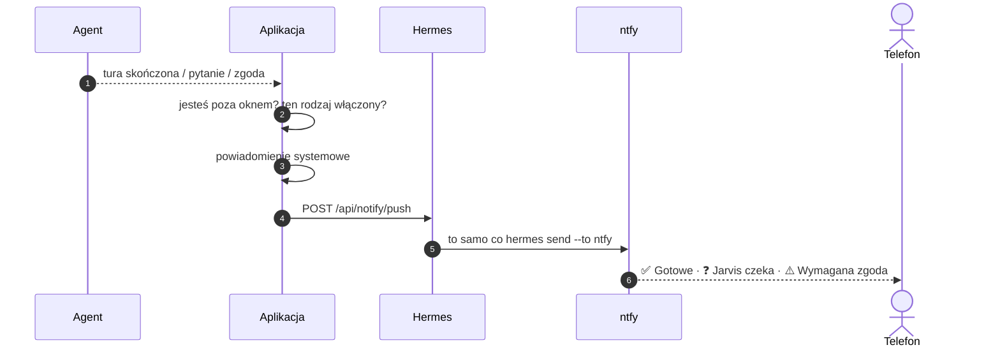
```mermaid
sequenceDiagram
    autonumber
    participant A as Agent
    participant App as Aplikacja
    participant H as Hermes
    participant N as ntfy
    actor T as Telefon
    A-->>App: tura skończona / pytanie / zgoda
    App->>App: jesteś poza oknem? ten rodzaj włączony?
    App->>App: powiadomienie systemowe
    App->>H: POST /api/notify/push
    H->>N: to samo co hermes send --to ntfy
    N-->>T: ✅ Gotowe · ❓ Jarvis czeka · ⚠️ Wymagana zgoda
```

- Telefon dostaje **dokładnie to, co pokazałby pulpit** — te same reguły: tylko gdy nie patrzysz na okno, tylko włączone rodzaje, bez duplikatów.
- Pushują się tylko sprawy ważne: koniec pracy, błąd, pytanie, zgoda. Alerty o kredytach i wtyczkach zostają na komputerze.
- Temat, serwer i token trzyma wtyczka ntfy (te same ustawienia co przy zadaniach cyklicznych); tekst jest skracany do rozmiaru ekranu blokady.
- Dla prywatności użyj długiego, trudnego do zgadnięcia tematu albo własnego serwera ntfy z kontrolą dostępu.

---

## Modele i OpenRouter

Jeden klucz OpenRouter daje dostęp do GPT, Claude, Gemini, DeepSeek i Hermesa.

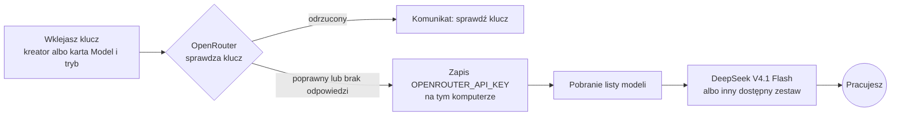
```mermaid
flowchart LR
    K["Wklejasz klucz<br/>kreator albo karta Model i tryb"] --> V{"OpenRouter<br/>sprawdza klucz"}
    V -->|"odrzucony"| E["Komunikat: sprawdź klucz"]
    V -->|"poprawny lub brak odpowiedzi"| S["Zapis OPENROUTER_API_KEY<br/>na tym komputerze"]
    S --> C["Pobranie listy modeli"]
    C --> D["DeepSeek V4.1 Flash<br/>albo inny dostępny zestaw"]
    D --> W(("Pracujesz"))
```

- **Gotowe zestawy** w karcie **Model i tryb**: DeepSeek V4.1 Flash (polecany do pracy), GPT, Claude, Gemini, Hermes i darmowy model. Zestaw pojawia się tylko wtedy, gdy OpenRouter naprawdę serwuje dany model.
- **Tryby pracy**: *Szybki* · *Zrównoważony* · *Głęboki* — jak długo Jarvis „myśli” przed odpowiedzią.
- Pełna lista dostawców i modeli: **Ustawienia → Dostawcy** albo menu modelu przy polu wiadomości.

---

## Motyw i język

Oba przełączniki są na dole lewego paska.

- **Motyw** — ☀ Jasny · ☾ Ciemny · 🖥 Jak w systemie. Skórka AI Evolution Jarvis ma dopracowane obie palety. Na ciemnym tle orb świeci jak światło, na jasnym jest rysowany jak tusz, żeby pozostał czytelny.
- **Język** — **PL / EN**. Zmienia cały interfejs: pulpit, karty paneli, szablony zadań, etykiety modelu, a także język, w którym Jarvis opowiada raport dnia.

---

## Konfiguracja

Ustawienia są w `~/.hermes/config.yaml`, a klucze API — w `~/.hermes/.env`. Większość zmienisz w aplikacji; poniżej to, co warto znać.

```yaml
voice:
  engine: classic                 # classic = STT → agent → TTS · realtime = głos Live
  realtime:
    model: gpt-realtime           # albo przypięta wersja: gpt-realtime-2.1 / gpt-realtime-2.1-mini
    voice: marin
    language: pl
  briefing_phrases:               # frazy uruchamiające raport dnia; [] wyłącza
    - wake up tatuś wrócił
    - tatuś wrócił
    - raport dnia

dashboard:
  news_feeds: []                  # AI News Live; puste = domyślne źródła AI
  briefing_feeds:                 # świat w raporcie dnia; puste = BBC, Guardian, NPR, TVN24, Polsat News
    - https://tvn24.pl/najnowsze.xml
    - { name: BBC World, url: https://feeds.bbci.co.uk/news/world/rss.xml }

wake_word:                        # raport dnia bez otwierania rozmowy
  enabled: true
  provider: sherpa                # rozpoznaje dowolną frazę
  phrase: wake up tatuś wrócił
```

| Klucz w `.env` | Do czego |
| --- | --- |
| `OPENROUTER_API_KEY` | modele przez OpenRouter (zapisuje go kreator albo karta Model i tryb) |
| `OPENAI_API_KEY` | głos Live (OpenAI Realtime) i OpenAI jako dostawca |
| `NTFY_TOPIC` (+ opcjonalnie `NTFY_SERVER_URL`, `NTFY_TOKEN`) | powiadomienia na telefon przez ntfy |

---

## Bezpieczeństwo

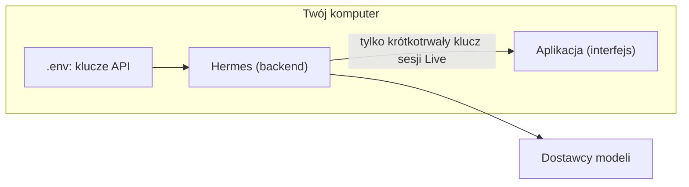
```mermaid
flowchart LR
    subgraph PC["Twój komputer"]
        ENV[".env: klucze API"]
        HB["Hermes (backend)"]
        UI["Aplikacja (interfejs)"]
        ENV --> HB
        HB -->|"tylko krótkotrwały klucz sesji Live"| UI
    end
    HB --> PROV["Dostawcy modeli"]
```

- Klucze API trafiają do `.env` na Twoim komputerze — nie do stanu kreatora ani do pamięci przeglądarki.
- Klucz OpenAI dla trybu Live nigdy nie trafia do interfejsu: aplikacja dostaje tylko krótkotrwały klucz sesji.
- Nagłówki wiadomości w raporcie dnia są oznaczone dla modelu jako dane z zewnątrz — agent je streszcza, ale nie wykonuje zawartych w nich poleceń.
- Operacje wymagające zgody przechodzą przez mechanizm zatwierdzania Hermesa (tryb ustawisz w kroku „Zgody”).
- Zmiana profilu lub połączenia nie przenosi stanu do innego profilu.
- Jarvis nie dodaje drugiego agenta ani osobnego runtime — głos Live to tylko warstwa mowy.

---

## Dla programistów

### Uruchomienie ze źródeł

Wymagania: Node.js i npm, Python 3.11+.

```bash
git clone https://github.com/aievolutionpl/ai-evolution-jarvis.git
cd ai-evolution-jarvis
npm install                    # zależności całego monorepo

cd apps/desktop
npm run dev                    # aplikacja w trybie deweloperskim
```

Build produkcyjny:

```bash
cd apps/desktop
npm run build
npm run pack                   # → apps/desktop/release/<platforma>-unpacked/
```

### Gdzie co jest

| Obszar | Pliki |
| --- | --- |
| Powłoka i nawigacja | [`shell.tsx`](apps/desktop/src/app/jarvis/shell.tsx), [`navigation.tsx`](apps/desktop/src/app/jarvis/navigation.tsx), [`app/index.tsx`](apps/desktop/src/app/index.tsx) |
| Pulpit | [`dashboard.tsx`](apps/desktop/src/app/jarvis/dashboard.tsx), [`home-hero.tsx`](apps/desktop/src/app/jarvis/home-hero.tsx), [`rail-cards.tsx`](apps/desktop/src/app/jarvis/rail-cards.tsx) |
| Orb | [`particle-orb.ts`](apps/desktop/src/app/jarvis/particle-orb.ts), [`plasma.ts`](apps/desktop/src/app/jarvis/plasma.ts), [`plasma-canvas.tsx`](apps/desktop/src/app/jarvis/plasma-canvas.tsx), [`core.tsx`](apps/desktop/src/app/jarvis/core.tsx) |
| Onboarding | [`onboarding.tsx`](apps/desktop/src/app/jarvis/onboarding.tsx), [`onboarding-welcome.tsx`](apps/desktop/src/app/jarvis/onboarding-welcome.tsx), [`onboarding-connections.tsx`](apps/desktop/src/app/jarvis/onboarding-connections.tsx), [`openrouter-connect.ts`](apps/desktop/src/app/jarvis/openrouter-connect.ts) |
| Połączenia | [`connections-catalog.ts`](apps/desktop/src/app/jarvis/connections-catalog.ts), [`connections/index.tsx`](apps/desktop/src/app/connections/index.tsx) |
| Instalacja i ikona | [`install-jarvis.sh`](scripts/install-jarvis.sh), [`install-jarvis.ps1`](scripts/install-jarvis.ps1), [`desktop-shortcut.ts`](apps/desktop/electron/desktop-shortcut.ts), [`assets/icon.png`](apps/desktop/assets/icon.png) |
| Głos Live | [`realtime-voice.ts`](apps/desktop/src/lib/realtime-voice.ts), [`use-realtime-conversation.ts`](apps/desktop/src/app/chat/composer/hooks/use-realtime-conversation.ts), [`voice_realtime.py`](hermes_cli/web_routers/voice_realtime.py) |
| Raport dnia | [`briefing.ts`](apps/desktop/src/app/jarvis/briefing.ts), [`briefing.py`](hermes_cli/web_routers/briefing.py) |
| Pulse | [`pulse.ts`](apps/desktop/src/app/jarvis/pulse.ts), [`pulse.py`](hermes_cli/web_routers/pulse.py) |
| Pasek boczny i pulpit | [`navigation.tsx`](apps/desktop/src/app/jarvis/navigation.tsx), [`insights-card.tsx`](apps/desktop/src/app/jarvis/insights-card.tsx), [`quick-access.tsx`](apps/desktop/src/app/jarvis/quick-access.tsx), [`focus-mode.ts`](apps/desktop/src/app/jarvis/focus-mode.ts) |
| Powiadomienia na telefon | [`native-notifications.ts`](apps/desktop/src/store/native-notifications.ts), [`push_notify.py`](hermes_cli/web_routers/push_notify.py) |
| Motyw | [`ai-evolution-jarvis.ts`](apps/desktop/src/themes/ai-evolution-jarvis.ts) |
| Tłumaczenia | [`pl.ts`](apps/desktop/src/i18n/pl.ts), [`en.ts`](apps/desktop/src/i18n/en.ts) |

Zasady projektu: [AGENTS.md](AGENTS.md), [apps/desktop/AGENTS.md](apps/desktop/AGENTS.md), [projekt produktu](docs/product/AI_EVOLUTION_JARVIS_DESIGN.md).

### Testy

```bash
cd apps/desktop
npm run typecheck              # TypeScript
npm run lint                   # ESLint
npx vitest run                 # testy interfejsu i logiki
npm run build && npx playwright test e2e/jarvis-shell-vertical.spec.ts   # E2E w prawdziwym Electronie

cd ../..
scripts/run_tests.sh tests/hermes_cli/   # testy backendu — zawsze przez ten skrypt, nie gołym pytest
```

---

## Ręcznie z Releases

| System | Co pobrać | Co się dzieje |
| --- | --- | --- |
| **Windows** | `AI-Evolution-Jarvis-<wersja>-win-x64.exe` | Instalator po polsku, bez uprawnień administratora. Tworzy ikonę na pulpicie i wpis w menu Start, po zakończeniu uruchamia aplikację. |
| **macOS** | `AI-Evolution-Jarvis-<wersja>-mac-<arch>.dmg` | Przeciągnij aplikację do folderu `Programy`. Ikonę na pulpicie utworzysz w ustawieniach. |
| **Linux** | `.AppImage`, `.deb` lub `.rpm` | AppImage: oznacz jako wykonywalny i uruchom; `.deb`/`.rpm` dodają wpis w menu aplikacji. |

Wydania: [Releases](https://github.com/aievolutionpl/ai-evolution-jarvis/releases). Aplikacja sama zakłada ikonę na pulpicie przy pierwszym uruchomieniu (Windows, Linux); jeśli jej brakuje: **Ustawienia → Zaawansowane → Ikona na pulpicie → Utwórz ikonę**.

---

## Roadmapa

**Zrobione**

- [x] Powłoka produktu z jedną nawigacją, pulpit i aktywność
- [x] Orb zmieniający kształt, jasny i ciemny motyw
- [x] Bezpieczny onboarding z szybkim startem OpenRouter → DeepSeek
- [x] Głos klasyczny i Live (OpenAI Realtime)
- [x] Raport dnia na komendę głosową
- [x] Pełny interfejs PL / EN
- [x] Pulse: proaktywne propozycje, które uczą się z odrzuceń (za Leonem)
- [x] Nowy pulpit: logo, menu w grupach, tryb skupienia, Spostrzeżenia i Szybki dostęp
- [x] Powiadomienia na telefon przez ntfy
- [x] Własna ikona, instalacja jak aplikacja, kreator „Jak działa” i strona Połączenia (Google, poczta, API)
- [x] Branding, packaging, instalacja jednym poleceniem

**Następne**

- [ ] Pełny pion E2E i podpisywanie wydań na wszystkich systemach
- [ ] Routing Ekonomiczny / Zrównoważony / Premium ([plan](docs/product/AI_EVOLUTION_JARVIS_PREMIUM_ROUTING_CUSTOMIZATION_PLAN.md))
- [ ] Personalizacja głosu, wyglądu i zachowania
- [ ] Dalsze usprawnienia na tablet i telefon

---

## Licencja i atrybucja

AI Evolution Jarvis jest rozwijany przez **AI Evolution** jako produkt oparty na projekcie open source **Hermes Agent** od [Nous Research](https://nousresearch.com). Projekt zachowuje licencję [MIT](LICENSE), informacje o prawach autorskich oraz atrybucję upstream. Szczegóły aplikacji desktopowej: [apps/desktop/README.md](apps/desktop/README.md).

Mechanizm Pulse i powitanie zależne od pory dnia są adaptacją pomysłów z [Leon](https://github.com/leon-ai/leon) (MIT, © Louis Grenard).

<div align="center">

**AI Evolution Jarvis**

*Twój prywatny agent. Jedno miejsce. Realna praca.*

[GitHub](https://github.com/aievolutionpl/ai-evolution-jarvis) · [Issues](https://github.com/aievolutionpl/ai-evolution-jarvis/issues) · [Hermes Agent](https://github.com/NousResearch/hermes-agent)

</div>
